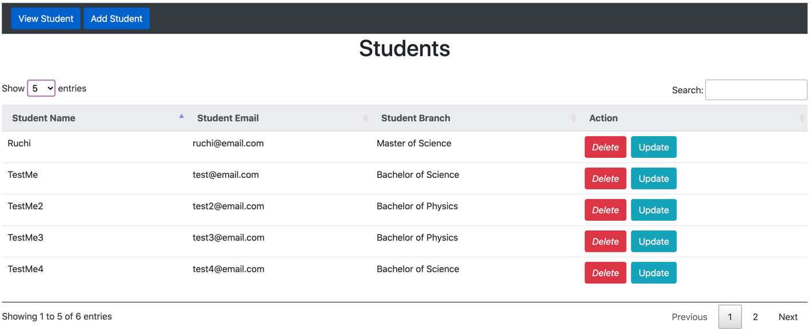
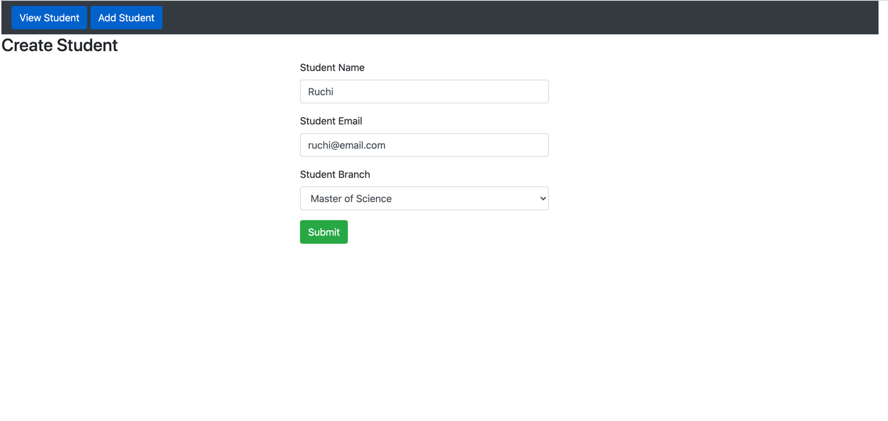
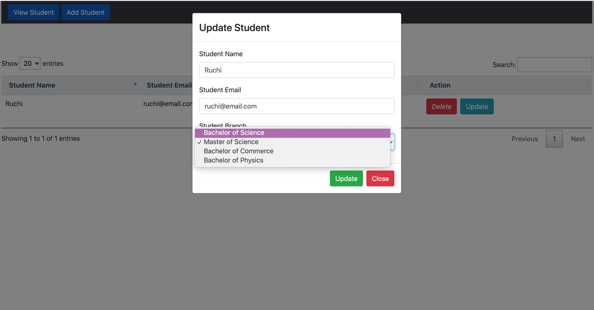

# Student CRUD Angular + SpringBoot App

Developed a single page Angular app with SpringBoot as a back-end and MySQL as database.

This app performs following operations:
- List all students (supports pagination on UI side)
- Provides an interface to add new students to database (has a client & server side validation)
- Specific student can be updated
- Student can be removed from the database

## Used following back-end technologies:
- Java 8
- Spring Boot including Spring Core for dependency injection
- Spring Data JPA & Hibernate
- MySQL

## Used following technologies for front-end:
- Angular with Router, Forms, HTTP & Datatables modules

## Screenshots:

